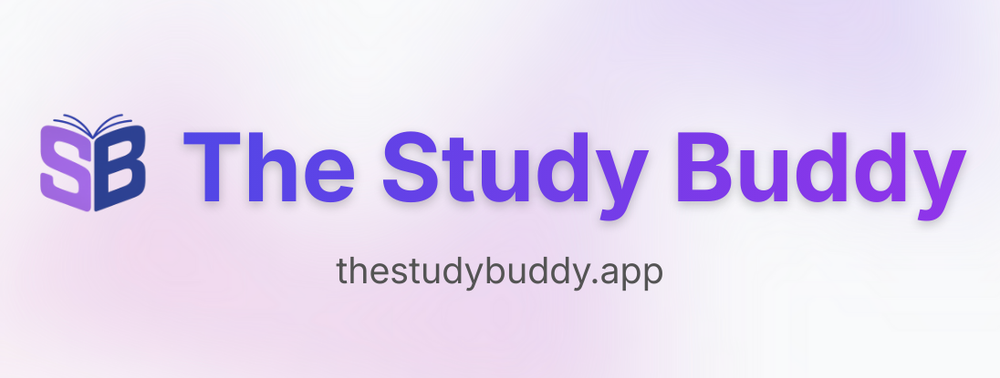

<h1 align="center">The Study Buddy</h1>
<p align="center">
  <a href="https://thestudybuddy.app" target="_blank">
    
  </a>
</p>
<p align="center">
  <a href="https://thestudybuddy.app"><strong>🌐 thestudybuddy.app</strong></a>
</p>

<p align="center">
  An AI-powered study assistant that turns your notes into flashcards and lets you chat with an AI that actually understands your material.
</p>

<hr />


The Study Buddy is an AI-powered learning tool that helps students upload homework notes, turn them into flashcards, and chat with an AI that understands their content.

Built with Express.js REST API, Azure OpenAI, MongoDB Atlas, and deployed across Azure App Service (backend) and DigitalOcean App Platform (frontend).

---

## Table of Contents
- [MVP Features](#mvp-features)
- [Stretch Features](#stretch-features)
- [Tech Stack](#tech-stack-azure-centric)
- [How It Works](#how-it-works)
- [Backend Architecture Overview](#backend-architecture-overview)
- [Local Development Setup](#local-development-setup)
  - [Prerequisites](#prerequisites)
  - [Installation Steps](#installation-steps)
  - [Quick Command Reference](#quick-command-reference)
- [Deployment](#deployment)
- [Project Structure](#project-structure)
- [Page Navigation Flow](#page-navigation-flow)
- [Development Phases](#development-phases-for-thestudybuddy)
  - [Phase 1 — Frontend Skeleton](#phase-1--frontend-skeleton-)
  - [Phase 2 — Frontend UI Components & Firebase Auth Integration](#phase-2--frontend-ui-components--firebase-auth-integration-)
  - [Phase 3 — Deploy Frontend](#phase-3--deploy-frontend-)
  - [Phase 4 — Backend Development (Azure + MongoDB)](#phase-4--backend-development-azure--mongodb--)
  - [Phase 5 — Connect Frontend and Backend](#phase-5--connect-frontend-and-backend--)
  - [Phase 6 — Stretch Features](#phase-6--stretch-features)

---

# MVP Features

- **Subject-Based Organization** - Create and manage subjects (e.g., Biology 101, Calculus II)
- **Upload Notes** - Upload up to 10 PDF notes per subject
- **AI-Generated Flashcards** - Azure OpenAI creates flashcard decks from your notes
- **Subject-Specific Chat** - AI chatbot that understands your notes, organized by subject
- **Firebase Authentication** - Secure login with email/password and Google sign-in
- **Dashboard** - Overview of subjects, flashcard decks, and chat history
- **Deployment** - Azure App Service (backend) + DigitalOcean App Platform (frontend)

---

# Stretch Features

- AI-generated quizzes  
- Daily streaks (Duolingo-style)  
- YouTube video recommendations  
- Related article discovery  
- Mindmaps with ToDiagram  
- XP, achievements, and gamification  
- Study analytics dashboard  

---

# Tech Stack

**Frontend**
- React 19 + Vite + TailwindCSS
- Firebase Auth (email/password + Google sign-in)
- React Router DOM (client-side routing)
- DigitalOcean App Platform (hosting with auto-deploy from GitHub)

**Backend**
- Express.js REST API (TypeScript)
- Azure OpenAI (GPT-4 for flashcards + context-aware chat)
- Azure Blob Storage (PDF files + extracted text storage)
- Azure App Service (hosting)

**Database**
- MongoDB Atlas with 7 collections:
  - `users` - User profiles and authentication data
  - `subjects` - User-created subjects with colors
  - `notes` - PDF metadata (fileName, blobUrl, textUrl, fileSize)
  - `flashcardsets` - AI-generated flashcard decks with cards array
  - `chatmessages` - Persistent chat history per subject
  - `reports` - Bug reports and feature requests
  - `versionupdates` - App version history and changelogs

**DevOps**
- GitHub Actions (CI/CD with automated builds and deployments)
- Azure App Service Deployment Center (linked to GitHub main branch)
- Environment-based configuration management

---

# How It Works

1. User logs in (Firebase Auth with email/password or Google)
2. User creates subjects (e.g., "Biology 101", "Calculus II")
3. User uploads PDF notes to specific subjects (up to 10 per subject) → Azure Blob Storage
4. Express.js API extracts text from PDFs using pdf-parse library
5. Azure OpenAI generates subject-specific flashcards from extracted text
6. MongoDB stores subjects, notes, flashcard sets, chat history, and user data
7. User studies flashcards filtered by subject with flip animations
8. User chats with AI that has full context of their uploaded notes
9. Chat history persists across sessions in MongoDB  

---

# Backend Architecture Overview

**Express.js REST API:**
- TypeScript-based REST API with repository pattern
- Firebase Admin SDK for token verification and authentication
- Middleware-based authorization ensuring users only access their own data
- CORS configuration for cross-origin requests from frontend

**MongoDB Collections (7 total):**
- **users** - User profiles (email, displayName, createdAt)
- **subjects** - User subjects with name, color, timestamps (indexed on userId)
- **notes** - PDF metadata: fileName, blobUrl, textUrl, fileSize, subjectId (compound index on userId + subjectId)
- **flashcardsets** - Flashcard decks with cards array (front/back fields), indexed on userId + subjectId
- **chatmessages** - Persistent chat history (role, content, timestamp), indexed on userId + subjectId + timestamp
- **reports** - Bug reports and feature requests (type, description, status)
- **versionupdates** - App version history with features and release dates

**Azure Blob Storage:**
- **notes-raw** container - Stores uploaded PDF files
- **notes-text** container - Stores extracted text from PDFs
- Secure blob operations with Azure Storage SDK

**Azure OpenAI Integration:**
- Deployment: GPT-4 (gpt-5-nano reasoning model)
- Flashcard generation with structured prompts
- Context-aware chat with full note context injection
- Smart text truncation for large note sets (40K character limit)

**API Endpoints:**
- `POST/GET/PUT/DELETE /api/subjects` - Subject CRUD operations
- `POST /api/notes/upload` - Multipart upload to Azure Blob + MongoDB metadata
- `POST /api/notes/extract-text/:id` - Extract text from PDF using pdf-parse
- `DELETE /api/notes/:id` - Delete from MongoDB and Azure Blob Storage
- `POST /api/flashcards/generate` - Generate flashcards with Azure OpenAI
- `GET /api/flashcards/:subjectId` - Get all flashcard sets for a subject
- `DELETE /api/flashcards/set/:setId` - Delete flashcard set
- `POST /api/ai/chat` - Send message, get AI response with note context
- `GET /api/chat/history/:subjectId` - Load persistent chat history
- `DELETE /api/chat/history/:subjectId` - Clear chat for a subject
- `POST /api/reports` - Submit bug reports or feature requests
- `GET /api/version-updates` - Get app version history

---

# Local Development Setup

Follow these steps to get The Study Buddy running on your local machine.

## Prerequisites
- **Node.js** (v18 or higher) and **npm** installed
- **Git** installed
- A code editor (VS Code recommended)

## Installation Steps

### 1. Clone the Repository
```bash
# Clone the repo
git clone https://github.com/jonahr4/TheStudyBuddy.git

# Navigate into the project
cd TheStudyBuddy
```

### 2. Navigate to Frontend Directory
```bash
cd thestudybuddy-frontend
```

### 3. Install Dependencies
This will install all required packages including React, Vite, TailwindCSS, Firebase, and React Router.

```bash
npm install
```

**What gets installed:**
- `react` (v19.2.0) & `react-dom` - UI framework
- `react-router-dom` (v7.9.6) - Client-side routing
- `firebase` (v12.6.0) - Authentication and analytics
- `vite` (v7.2.4) - Build tool and dev server
- `tailwindcss` (v3.4.18) - CSS framework
- `autoprefixer` & `postcss` - CSS processing
- `eslint` - Code linting

### 4. Set Up Environment Variables

**Contact Jonah for Firebase credentials!**

Create a `.env.local` file in the `thestudybuddy-frontend` directory:

```bash
# Create the file
touch .env.local

# Open it in your editor and add these variables:
VITE_FIREBASE_API_KEY=<get_from_jonah>
VITE_FIREBASE_AUTH_DOMAIN=<get_from_jonah>
VITE_FIREBASE_PROJECT_ID=<get_from_jonah>
VITE_FIREBASE_STORAGE_BUCKET=<get_from_jonah>
VITE_FIREBASE_MESSAGING_SENDER_ID=<get_from_jonah>
VITE_FIREBASE_APP_ID=<get_from_jonah>
VITE_FIREBASE_MEASUREMENT_ID=<get_from_jonah>
```

> **Important:** The `.env.local` file is already in `.gitignore` so your credentials won't be committed to Git.

### 5. Enable Firebase Authentication (Firebase Console)
If you have access to the Firebase Console:
1. Go to [Firebase Console](https://console.firebase.google.com/)
2. Select **TheStudyBuddy** project
3. Navigate to **Authentication** → **Sign-in method**
4. Enable **Email/Password** provider
5. Enable **Google** provider
   - Add authorized domains (localhost is already included)
   - No additional configuration needed for development

### 6. Set Up Backend (Required for full functionality)

The backend is an Express.js REST API built with TypeScript.

**Navigate to backend directory:**
```bash
cd ../thestudybuddy-backend
npm install
```

**Contact Jonah for credentials!**

Create a `.env` file in `thestudybuddy-backend`:
```bash
# MongoDB
MONGODB_URI=<get_from_jonah>

# Azure Blob Storage
STORAGE_CONNECTION_STRING=<azure_blob_storage_connection>
STORAGE_NOTES_RAW_CONTAINER=notes-raw
STORAGE_NOTES_TEXT_CONTAINER=notes-text

# Azure OpenAI
AZURE_OPENAI_ENDPOINT=<azure_openai_endpoint>
AZURE_OPENAI_API_KEY=<azure_openai_key>
AZURE_OPENAI_DEPLOYMENT_NAME=gpt-5-nano

# Firebase (for token verification)
FIREBASE_PROJECT_ID=thestudybuddy-8da15

# Frontend URL for CORS
FRONTEND_URL=http://localhost:5173

# Server Port (optional, defaults to 8080)
PORT=8080
```

**Build and start the Express backend:**
```bash
# Build TypeScript
npm run build

# Start the server
npm start

# OR for development with auto-reload:
npm run dev
```

Backend will run on `http://localhost:8080`

> **Note:** All features require the backend running. The backend handles authentication, file uploads, AI processing, and database operations.

### 7. Start the Frontend Development Server
```bash
cd ../thestudybuddy-frontend
npm run dev
```

You should see output like:
```
VITE v7.2.4  ready in 500 ms

➜  Local:   http://localhost:5173/
➜  Network: use --host to expose
```

**The app is now running at** `http://localhost:5173` 🎉

### 8. Verify Installation
Open your browser to `http://localhost:5173` and you should see:
- ✅ Landing page with gradient background
- ✅ Navbar with "Study Buddy" branding
- ✅ Buttons and navigation working
- ✅ Login page accessible at `/login`
- ✅ Create subjects and see them persist (if backend is running)

## Quick Command Reference

### Frontend Commands (thestudybuddy-frontend)
```bash
# Start development server (with hot reload)
npm run dev

# Build for production
npm run build

# Preview production build
npm run preview

# Run linter to check code quality
npm run lint
```

### Backend Commands (thestudybuddy-backend)
```bash
# Start Express server (development with auto-reload)
npm run dev

# Build TypeScript
npm run build

# Start production server (requires build first)
npm start

# Watch TypeScript compilation
npm run watch

# Clean build artifacts
npm run clean
```

---

## Deployment

The Study Buddy is deployed with a multi-cloud architecture:
- **Frontend**: DigitalOcean App Platform → https://thestudybuddy.app
- **Backend**: Azure App Service → https://thestudybuddy-api-b0ahd5hcfzerh6h4.eastus-01.azurewebsites.net

### Automated CI/CD Pipeline

**Frontend (DigitalOcean App Platform):**
- Automatic deployment on push to GitHub
- Vite production build with optimizations
- Environment variables configured in DigitalOcean dashboard
- CDN distribution for fast global delivery

**Backend (Azure App Service):**
- GitHub Actions workflow triggers on push to `main` branch
- Automated TypeScript build (`npm run build`)
- Deploys `dist/` folder to Azure App Service
- Uses Azure Deployment Center linked to GitHub repository
- Environment variables managed in Azure Portal Configuration

**GitHub Actions Workflow:**
```yaml
on:
  push:
    branches: [main]

jobs:
  build-and-deploy:
    - Build TypeScript
    - Create deployment package
    - Deploy to Azure App Service using publish profile
```

**Production Stack:**
- **Frontend**: React + Vite (served as static files from DigitalOcean)
- **Backend**: Express.js REST API on Azure App Service
- **Database**: MongoDB Atlas (shared cluster)
- **Storage**: Azure Blob Storage (notes-raw, notes-text containers)
- **AI**: Azure OpenAI (GPT-4 deployment)

---

## Project Structure
```
TheStudyBuddy/
├── thestudybuddy-frontend/     # React + Vite frontend
│   ├── src/
│   │   ├── assets/             # Images and static files
│   │   ├── components/         # Reusable UI components
│   │   │   ├── Navbar.jsx      # Navigation bar with Report button
│   │   │   ├── Layout.jsx      # Page wrapper with navbar
│   │   │   ├── PrivateRoute.jsx # Protected route wrapper
│   │   │   ├── SubjectModal.jsx # Create/edit subject modal
│   │   │   ├── ConfirmDialog.jsx # Delete confirmation dialog
│   │   │   ├── ReportModal.jsx # Bug report/feature request modal
│   │   │   └── VideoRecommendations.jsx # YouTube video recommendations
│   │   ├── contexts/           # React Context providers
│   │   │   ├── SubjectContext.jsx # Subject state management
│   │   │   └── NoteContext.jsx    # Note state management
│   │   ├── firebase/           # Firebase configuration
│   │   │   ├── config.js       # Firebase initialization
│   │   │   └── AuthContext.jsx # Auth state management
│   │   ├── services/           # API service layer
│   │   │   └── api.ts          # Backend API calls with auth
│   │   ├── pages/              # Route pages
│   │   │   ├── Landing.jsx     # Homepage with hero section
│   │   │   ├── Login.jsx       # Authentication page
│   │   │   ├── SignUp.jsx      # Registration with first name
│   │   │   ├── Dashboard.jsx   # Overview of subjects, decks, and chats
│   │   │   ├── Subjects.jsx    # List all subjects, create new ones
│   │   │   ├── SubjectDetail.jsx # Manage notes for a specific subject
│   │   │   ├── Flashcards.jsx  # Study flashcards (filter by subject)
│   │   │   ├── Chat.jsx        # AI chat (switch between subjects)
│   │   │   ├── TestBackend.jsx # Backend connection test page
│   │   │   └── NotFound.jsx    # 404 page
│   │   ├── App.jsx             # Main app with routes
│   │   ├── index.css           # Global styles and theming
│   │   └── main.jsx            # App entry point
│   ├── .env.local              # Environment variables (git-ignored)
│   └── package.json            # Dependencies
├── thestudybuddy-backend/      # Express.js REST API backend
│   ├── src/
│   │   ├── expressServer.ts    # Main Express.js server entry point
│   │   ├── index.ts            # Module exports
│   │   ├── db/
│   │   │   └── connectMongo.ts # MongoDB connection utility with retry logic
│   │   ├── firebase/
│   │   │   └── admin.ts        # Firebase Admin SDK initialization
│   │   ├── routes/             # Express route handlers
│   │   │   ├── subjects.ts     # Subject CRUD endpoints
│   │   │   ├── notes.ts        # Notes upload/delete/extract endpoints
│   │   │   ├── flashcards.ts   # Flashcards CRUD endpoints
│   │   │   ├── ai.ts           # AI chat endpoint with context injection
│   │   │   ├── chat.ts         # Chat history & stats endpoints
│   │   │   ├── users.ts        # User CRUD endpoints
│   │   │   ├── reports.ts      # Bug reports endpoints
│   │   │   └── versionUpdates.ts # Version history endpoints
│   │   ├── models/             # Mongoose schemas (7 collections)
│   │   │   ├── Subject.ts      # Subject schema with userId index
│   │   │   ├── Note.ts         # Note schema with compound indexes
│   │   │   ├── User.ts         # User schema
│   │   │   ├── FlashcardSet.ts # FlashcardSet with cards array
│   │   │   ├── ChatMessage.ts  # ChatMessage with timestamps
│   │   │   ├── Report.ts       # Report schema with status tracking
│   │   │   └── VersionUpdate.ts # VersionUpdate schema
│   │   ├── shared/
│   │   │   ├── expressAuth.ts  # Firebase token verification middleware
│   │   │   ├── types.ts        # TypeScript interfaces
│   │   │   ├── config/
│   │   │   │   └── limits.ts   # Resource limits (10 notes, 20 flashcard sets, etc.)
│   │   │   ├── repos/          # Repository pattern implementations
│   │   │   │   ├── SubjectRepository.ts       # Subject repo interface
│   │   │   │   ├── MongoSubjectRepository.ts  # MongoDB implementation
│   │   │   │   ├── NoteRepository.ts          # Note repo interface
│   │   │   │   ├── MongoNoteRepository.ts     # MongoDB implementation
│   │   │   │   ├── UserRepository.ts          # User repo interface
│   │   │   │   ├── MongoUserRepository.ts     # MongoDB implementation
│   │   │   │   └── FlashcardRepository.ts     # Flashcard repo interface
│   │   │   ├── storage/        # Azure Blob Storage utilities
│   │   │   │   └── blobClient.ts # Upload/download/delete blob operations
│   │   │   └── services/       # Service layer
│   │   │       └── textExtraction.ts # PDF text extraction with pdf-parse
│   │   ├── scripts/            # Utility scripts
│   │   │   └── seedVersionUpdates.ts # Seed version history data
│   ├── dist/                   # Compiled TypeScript (production deployment)
│   ├── .github/workflows/      # GitHub Actions CI/CD
│   │   └── deploying-backend_thestudybuddy-api.yml # Azure deployment workflow
│   ├── .env                    # Environment variables (git-ignored)
│   ├── tsconfig.json           # TypeScript compiler configuration
│   ├── package.json            # Dependencies and scripts
│   └── web.config              # Azure App Service configuration
├── .github/workflows/          # CI/CD workflows
│   └── deploying-backend_thestudybuddy-api.yml # Backend deployment
└── README.md                   # This file
```

## Page Navigation Flow
- **/** - Landing page (hero with call-to-action)
- **/login** - Sign in with email/password or Google
- **/dashboard** - Main dashboard showing:
  - Left: Subjects list (click to manage)
  - Center: Recent flashcard decks (by subject)
  - Right: Chat history count
- **/subjects** - View all subjects, create new ones
- **/subjects/:id** - Upload and manage up to 10 PDF notes per subject
- **/flashcards** - Study flashcards (filter by subject using tabs)
- **/chat** - Chat with AI (switch between subjects)

## Available Scripts
- `npm run dev` - Start development server with hot reload
- `npm run build` - Build for production
- `npm run preview` - Preview production build locally
- `npm run lint` - Run ESLint

## Troubleshooting

### Frontend Issues
- **Port already in use?** Change the port in `vite.config.js` or kill the process using port 5173
- **Firebase errors?** Double-check your `.env.local` file has all required variables
- **Module not found?** Run `npm install` again to ensure all dependencies are installed
- **API connection errors?** Verify backend is running on `http://localhost:8080`

### Backend Issues
- **Port 8080 already in use?** Kill the process: `lsof -ti:8080 | xargs kill -9`
- **MongoDB connection failed?** Verify `MONGODB_URI` in `.env` file
- **Firebase token verification errors?** Ensure `FIREBASE_PROJECT_ID` in `.env` matches your frontend project
- **CORS errors?** Check that `FRONTEND_URL` is set correctly in `.env` (should be `http://localhost:5173`)
- **TypeScript compilation errors?** Run `npm run build` to see detailed error messages
- **Azure Blob Storage errors?** Verify `STORAGE_CONNECTION_STRING` in `.env` is correct

### Full Stack Testing
- Visit `http://localhost:5173` for the frontend
- Backend should be running on `http://localhost:8080`
- Create a subject to test the full authentication flow
- Upload a PDF to test Azure Blob Storage integration
- Generate flashcards to test Azure OpenAI integration
- Check browser console and terminal for detailed error messages

---

# Development Phases for TheStudyBuddy

## Phase 1 — Frontend Skeleton ✅
Build the structure of the frontend with subject-based organization.

Tasks:
- ✅ Create project with Vite + React + Tailwind
- ✅ Set up routing with React Router DOM
- ✅ Implement subject-based architecture:
  - ✅ Subjects page - View all subjects, create new ones
  - ✅ Subject Detail page - Manage up to 10 PDF notes per subject
  - ✅ Dashboard with three sections:
    - Left: Subjects list (clickable to navigate to subject detail)
    - Center: Recent flashcard decks with subject labels
    - Right: Chat history count with link to chat
- ✅ Create core pages:
  - ✅ Landing Page (hero section with gradient background)
  - ✅ Login Page (email/password form + Google sign-in button)
  - ✅ Dashboard (three-column layout: subjects, decks, chat)
  - ✅ Subjects Page (subject cards with note counts and actions)
  - ✅ Subject Detail Page (drag-and-drop upload UI, note list)
  - ✅ Flashcards Page (subject selector tabs, deck filtering)
  - ✅ Chat Page (subject switcher, message interface)
  - ✅ Not Found Page (404 error page)
- ✅ Create layout components:
  - ✅ Navbar (Dashboard, Subjects, Flashcards, Chat, Login)
  - ✅ Layout wrapper (navbar + content area)
- ✅ Global theming system:
  - ✅ Reusable CSS classes (.btn-primary, .btn-secondary, .card, .input, .badge, etc.)
  - ✅ Gradient background system (pink-to-purple with custom shapes)
  - ✅ Dark mode support configured
  - ✅ Consistent indigo color scheme across all pages
- ✅ Firebase Auth setup:
  - ✅ Firebase SDK installed
  - ✅ Firebase config with environment variables
  - ✅ Login UI with email/password and Google sign-in
- ✅ Initialize GitHub repo and commit

Outcome:
✅ A fully styled, navigable app with subject-based organization, mock data, and Firebase Auth configured.---

## Phase 2 — Frontend UI Components & Firebase Auth Integration ✅
Build interactive UI elements and connect Firebase authentication.

Tasks:
- ✅ Firebase Auth integration:
  - ✅ Create AuthContext for global auth state
  - ✅ Wire up Login page (email/password + Google sign-in)
  - ✅ Add protected routes for authenticated pages (PrivateRoute component)
  - ✅ Add logout functionality to navbar
  - ✅ Create Sign Up page with first name field
  - ✅ Store first name in user profile (displayName)
  - ✅ Display first name (up to 10 chars) in navbar
  - ✅ Add logo (IMG_3002.png) to navbar
  - ✅ Add animated purple indicator to navbar
- ✅ Subject management UI:
  - ✅ Create new subject modal with color picker
  - ✅ Edit subject functionality
  - ✅ Delete subject with confirmation dialog
  - ✅ Subject cards with note/deck counts
  - ✅ Empty states for no subjects
- ✅ Note upload UI:
  - ✅ Implement drag-and-drop functionality
  - ✅ Add file preview in selected files list
  - ✅ File size/type validation (PDF only, 10MB max)
  - ✅ Enforce 10-note limit per subject
  - ✅ Upload multiple files at once
  - ✅ Upload progress indicators
- ✅ **Flashcard interface:**
  - ✅ Click-to-flip card animation
  - ✅ Previous/Next navigation buttons
  - ✅ Keyboard controls (← → arrows, Space/Enter to flip)
  - ✅ Card counter (e.g., "Card 5 of 25")
  - ✅ Back to flashcard list button
  - ✅ Study progress tracking per card (studied flag)
- ✅ **Chat interface:**
  - ✅ Scrollable message history
  - ✅ Auto-scroll to latest message
  - ✅ Subject switcher tabs
  - ✅ Clear chat button
  - ✅ Loading states during AI response
  - ✅ Message timestamps
  - ✅ User avatars and AI avatar
  - ✅ Typing indicator with animated dots
- ✅ UI polish:
  - ✅ Add loading states and spinners
  - ✅ Error handling UI (error alerts)
  - ✅ Confirmation modals for destructive actions (ConfirmDialog component)
  - ✅ Responsive design for mobile/tablet
  - ✅ Empty states for all pages
  - ✅ Gradient backgrounds with blur effects

Outcome:
✅ Fully interactive frontend with Firebase Auth working, Subjects fully functional with real data, mock data remaining for notes/decks/chats, polished animations, and responsive design.

---

## Phase 3 — Deploy Frontend ✅
Deploy the frontend before the backend exists.

Tasks:
- ✅ Create Azure Static Web App
- ✅ Connect GitHub repo
- ✅ Configure build settings
- ✅ Verify automatic deployments on push

Outcome:
✅ Publicly accessible frontend site hosted on Azure.

---

## Phase 4 — Backend Development (Azure + MongoDB) ✅
Build the backend API and serverless functions to support core features with subject-based organization.

### Current Status
✅ **All core features implemented** - Subjects, Notes, AI Flashcards, AI Chat, and User Feedback fully functional  
✅ **Backend running locally** - Azure Functions working on localhost:7071 with all endpoints operational  
✅ **AI integration complete** - Azure OpenAI (gpt-5-nano) powering flashcard generation and RAG chat  
✅ **Persistent storage working** - MongoDB Atlas storing all user data, chat history, flashcard sets, and bug reports  
✅ **PDF processing functional** - Text extraction from PDFs using pdf-parse  
✅ **Modern UI complete** - Glassmorphism design with gradient accents and smooth animations  
⏳ **Production deployment pending** - Backend needs to be deployed to Azure Cloud

### MongoDB Models & Setup
- ✅ Set up MongoDB Atlas cluster (`studybuddy` database)
- ✅ Connected MongoDB to backend with connection pooling
- ⬜ Create `users` collection schema (email, name, createdAt)
- ✅ **Created `subjects` collection schema** (name, color, userId, createdAt)
  - ✅ Implemented Mongoose model with validation
  - ✅ Created MongoSubjectRepository with full CRUD operations
  - ✅ Added userId index for fast user-specific queries
  - ✅ Tested with real data - working perfectly!
- ✅ **Created `notes` collection schema** (fileName, blobUrl, textUrl, fileSize, subjectId, userId, uploadedAt)
  - ✅ Implemented Mongoose model with validation
  - ✅ Created MongoNoteRepository with full CRUD operations
  - ✅ Added indexes on userId and subjectId for fast queries
  - ✅ Compound index on (userId, subjectId) for efficient filtering
  - ✅ Tested with real uploads - working perfectly!
- ✅ **Created `flashcardsets` collection schema** (userId, subjectId, name, description, flashcards array)
  - ✅ Implemented Mongoose FlashcardSet model
  - ✅ Each flashcard has `front` and `back` text fields
  - ✅ Indexed on userId and subjectId for fast queries
  - ✅ Tested with AI-generated flashcards - working perfectly!
- ✅ **Created `chatmessages` collection schema** (userId, subjectId, role, content, timestamp)
  - ✅ Implemented Mongoose ChatMessage model
  - ✅ Stores user, assistant, and system messages
  - ✅ Indexed on userId, subjectId, and timestamp for efficient history queries
  - ✅ Tested with persistent chat history - working perfectly!
- ✅ **Created `reports` collection schema** (userId, userEmail, type, description, status, timestamps)
  - ✅ Implemented Mongoose Report model for bug reports and feature requests
  - ✅ Supports 4 types: bug, feature, improvement, other
  - ✅ Status tracking: new, in-progress, resolved, closed
  - ✅ Indexed on userId for fast user-specific queries
  - ✅ Tested with report submissions - working perfectly!
- ✅ Write MongoDB connection utility (with retry logic and error handling)
- ✅ Test database connections and CRUD operations (all working)

### API Routes (Azure Functions HTTP Triggers)
- ✅ **Set up Azure Functions v4 TypeScript project**
- ✅ **Implemented Firebase Admin SDK for token verification**
  - ✅ Extracts Bearer token from Authorization header
  - ✅ Verifies token with Firebase Admin
  - ✅ Returns actual user's Firebase UID
  - ✅ Ensures users only see their own data
- ✅ **Subject API fully implemented:**
  - ✅ `POST /api/subjects` - Create new subject (authenticated)
  - ✅ `GET /api/subjects` - List all subjects for authenticated user
  - ✅ `GET /api/subjects/:id` - Get single subject details
  - ✅ `PUT /api/subjects/:id` - Update subject (name, color)
  - ✅ `DELETE /api/subjects/:id` - Delete subject
  - ✅ All routes enforce user ownership validation
  - ✅ Proper error handling with status codes
- ✅ **Note API implemented:**
  - ✅ `GET /api/notes/:subjectId` - Get all notes for a subject (authenticated, sorted by date)
  - ✅ `POST /api/notes/upload` - Upload PDF to Azure Blob + save metadata to MongoDB
  - ✅ `DELETE /api/notes/:id` - Delete note from MongoDB AND Azure Blob Storage
  - ✅ `POST /api/notes/extract-text/:id` - Extract text from PDF and save to Blob Storage
  - ✅ All routes enforce user ownership validation
  - ✅ Proper cleanup of orphaned blobs on deletion
- ✅ **Flashcard API implemented:**
  - ✅ `POST /api/flashcards/generate` - Generate flashcards with AI from subject notes
  - ✅ `GET /api/flashcards/{subjectId}` - Get all flashcard sets for a subject
  - ✅ `GET /api/flashcards/set/{setId}` - Get specific flashcard set with all cards
  - ✅ `DELETE /api/flashcards/set/{setId}` - Delete a flashcard set
  - ✅ All routes enforce user ownership validation
- ✅ **Chat API implemented:**
  - ✅ `POST /api/ai/chat` - Send message and get AI response with RAG context
  - ✅ `GET /api/chat/history/{subjectId}` - Load persistent chat history
  - ✅ `GET /api/chat/stats` - Get chat statistics (total messages, conversations, recent chats)
  - ✅ `DELETE /api/chat/history/{subjectId}` - Clear chat history for subject
  - ✅ All routes enforce user ownership validation
- ✅ **Reports API implemented:**
  - ✅ `POST /api/reports` - Submit bug reports or feature requests
  - ✅ `GET /api/reports` - Get user's submitted reports
  - ✅ All routes enforce user ownership validation
- ✅ Add error handling with try/catch blocks
- ✅ Configure CORS for local development

### Azure Blob Storage Integration ✅
- ✅ **Set up Azure Storage Account** (`studybuddystorage`) with containers:
  - ✅ `notes-raw` - stores uploaded PDF files
  - ✅ `notes-text` - stores extracted text from PDFs
- ✅ **Installed Azure Blob Storage SDK** (`@azure/storage-blob`)
- ✅ **Created blob service client** with connection string in `local.settings.json`
- ✅ **Implemented `POST /api/notes/upload` endpoint:**
  - ✅ Accepts file from multipart/form-data
  - ✅ Validates file type (PDF only) and size (max 10MB)
  - ✅ Generates unique blob name with timestamp
  - ✅ Uploads file to `notes-raw` container
  - ✅ Saves note metadata to MongoDB (fileName, blobUrl, subjectId, userId, fileSize)
  - ✅ Returns note metadata to client
- ✅ **Implemented blob deletion** - deletes from Azure Blob Storage when note is deleted
- ✅ **Created `blobClient.ts`** with `uploadPdfToRawContainer()` and `deleteBlobByUrl()`
- ⬜ Add SAS token generation for secure file access (pending)

### Azure Functions - Text Extraction ✅
- ✅ **Created Azure Function `ProcessNoteText`** (HTTP trigger)
- ✅ **Installed PDF parsing library** (`pdf-parse`)
- ✅ **Implemented text extraction logic:**
  - ✅ Download PDF from `notes-raw` Blob Storage
  - ✅ Extract text from PDF using pdf-parse
  - ✅ Upload extracted text to `notes-text` container
  - ✅ Update note document in MongoDB with `textUrl`
- ✅ **Added error handling** for corrupted/unreadable PDFs
- ✅ **Tested with real PDFs** - extraction working perfectly
- ✅ **Added "Extract Text" button** to Subject Detail page UI

### Azure OpenAI Integration ✅
- ✅ **Set up Azure OpenAI resource** with gpt-5-nano deployment
- ✅ **Installed Azure OpenAI SDK** (`openai` package)
- ✅ **Configured Azure OpenAI client:**
  - ✅ Endpoint: `https://jonah-mic9jlpb-eastus2.cognitiveservices.azure.com/`
  - ✅ Deployment: `gpt-5-nano` (reasoning model)
  - ✅ API Version: `2024-12-01-preview`
- ✅ **Handled reasoning model specifics:**
  - ✅ Used `max_completion_tokens` instead of `max_tokens`
  - ✅ Set high token budget (4000-8000) for reasoning + response
  - ✅ Handled empty `content` by checking reasoning output

### Azure Functions - Flashcard Generation ✅
- ✅ **Created Azure Function `GenerateFlashcards`** (HTTP trigger)
- ✅ **Created `FlashcardSet` MongoDB model** with schema:
  - ✅ `userId`, `subjectId`, `name`, `description`
  - ✅ `flashcards` array with `front` and `back` fields
  - ✅ Indexed on `userId` and `subjectId` for fast queries
- ✅ **Implemented `POST /api/flashcards/generate` endpoint:**
  - ✅ Accepts `subjectId`, `name`, and optional `description` (focus)
  - ✅ Fetches all note texts for the subject from Blob Storage
  - ✅ Builds AI prompt: "Create 10-15 flashcards from these notes..."
  - ✅ Calls Azure OpenAI with system prompt + note context
  - ✅ Parses JSON response and extracts flashcards
  - ✅ Saves flashcard set to MongoDB with user and subject association
  - ✅ Returns generated flashcard set to client
- ✅ **Implemented flashcard CRUD endpoints:**
  - ✅ `GET /api/flashcards` - Get all flashcard sets for authenticated user
  - ✅ `GET /api/flashcards/{subjectId}` - Get all sets for a subject
  - ✅ `GET /api/flashcards/set/{setId}` - Get specific flashcard set
  - ✅ `DELETE /api/flashcards/set/{setId}` - Delete a flashcard set
  - ✅ `PATCH /api/flashcards/set/{setId}/card/{cardIndex}/studied` - Mark card as studied
- ✅ **Added error handling** for OpenAI API failures and parsing errors
- ✅ **Token optimization complete** - Smart truncation (30K chars limit) + reasoning_effort: "none"

### Azure Functions - RAG/AI Chat Logic ✅
- ✅ **Created Azure Function `ChatWithAI`** (HTTP trigger)
- ✅ **Created `ChatMessage` MongoDB model** for persistent chat history:
  - ✅ Schema: `userId`, `subjectId`, `role` (user/assistant/system), `content`, `timestamp`
  - ✅ Indexed on `userId`, `subjectId`, and `timestamp` for efficient queries
- ✅ **Implemented `POST /api/chat` endpoint:**
  - ✅ Accepts `message` and `subjectId` in request body
  - ✅ Loads last 20 chat messages from MongoDB (persistent history)
  - ✅ Fetches all note texts for the subject from Blob Storage
  - ✅ Builds comprehensive system prompt with Study Buddy personality:
    - "You are **The Study Buddy**, a friendly AI tutor..."
    - 10 rules including: quote from notes, keep answers short, end with questions
  - ✅ Includes full note context in system message (RAG implementation)
  - ✅ Sends: system prompt + last 20 messages + new user message to Azure OpenAI
  - ✅ Uses `max_completion_tokens: 4000` for reasoning model
  - ✅ Saves both user message and AI response to MongoDB
  - ✅ Returns AI response to client
- ✅ **Implemented chat history management:**
  - ✅ `GET /api/chat/history/{subjectId}` - Load chat history for subject
  - ✅ `DELETE /api/chat/history/{subjectId}` - Clear chat history for subject
- ✅ **Frontend integration:**
  - ✅ Chat UI loads history from MongoDB on subject switch
  - ✅ Messages persist across page refreshes
  - ✅ "Clear Chat" button to reset conversation
  - ✅ No longer sends chat history in request (backend loads from DB)
- ✅ **Tested with real notes and questions** - RAG retrieval working perfectly

### Optional: Azure Cognitive Search (Vector Retrieval)
- ⬜ Set up Azure Cognitive Search service
- ⬜ Create search index for note embeddings
- ⬜ Generate embeddings for note text using Azure OpenAI
- ⬜ Store embeddings in Cognitive Search
- ⬜ Implement vector search for relevant note retrieval in RAG

### Testing & Deployment
- ✅ **Local testing fully working:**
  - ✅ Created test page at `/test-backend` for API validation
  - ✅ Backend running on localhost:7071
  - ✅ Frontend running on localhost:5174
  - ✅ CORS configured for local development
  - ✅ Subjects CRUD operations tested and working
  - ✅ Notes upload/delete/extract tested and working
  - ✅ AI flashcard generation tested with real PDFs
  - ✅ AI chat with RAG tested with real note context
  - ✅ User authentication and data isolation verified
  - ✅ Persistent chat history tested across sessions
  - ✅ Bug report system tested and working
- ✅ **End-to-end testing complete:**
  - ✅ Upload PDF → Extract text → Generate flashcards → Study cards
  - ✅ Upload notes → Chat with AI → Get responses with note context
  - ✅ Create subjects → Upload notes → Generate sets → View/flip cards
  - ✅ Submit bug reports → Stored in MongoDB with user info
- ✅ **UI/UX testing complete:**
  - ✅ Modern glassmorphism design implemented
  - ✅ Gradient purple-pink buttons across all pages
  - ✅ Fixed scrolling issues on all pages
  - ✅ Dashboard displays real flashcard and chat statistics
  - ✅ Navbar with Report button and improved spacing
  - ✅ Consistent styling across Subjects, Chat, and Flashcards pages
- ⬜ Write unit tests for API routes
- ⬜ Write integration tests for Azure Functions
- ⬜ **Deploy Azure Functions to Azure Cloud** (currently only running locally)
- ⬜ Set up environment variables in Azure Portal
- ⬜ Configure CORS for production frontend domain
- ⬜ Update frontend `VITE_API_URL` to point to deployed Azure Functions
- ⬜ Test deployed endpoints from production frontend

**Current Status:** All features fully functional locally with comprehensive end-to-end testing complete. Modern UI with glassmorphism design implemented. Backend deployment to Azure cloud is the final step.

Outcome (when complete):
Backend supports all core functionality with subject-based organization, AI-powered flashcards, RAG chat, and user feedback system.

---

## Phase 5 — Connect Frontend and Backend ✅
Replace mock data with real API calls and data from MongoDB.

### Completed Tasks:
- ✅ **Subject management fully integrated:**
  - ✅ Created SubjectContext with React Context API
  - ✅ Connected Subjects page to subject API (full CRUD)
  - ✅ Dashboard displays real subject data from MongoDB
  - ✅ Context refetches subjects on user login/logout
  - ✅ Create, update, delete subjects working perfectly
  - ✅ Color conversion between Tailwind classes and hex
  - ✅ Loading states and error handling implemented
  - ✅ Modern glassmorphism design with gradient purple-pink buttons
- ✅ **API Service Layer:**
  - ✅ Created `services/api.ts` with authentication
  - ✅ Automatic Firebase token injection in requests
  - ✅ Graceful degradation when backend unavailable (production)
  - ✅ Environment-aware API URL (dev vs production)
  - ✅ Added reportApi for bug reports and feature requests
- ✅ **Authentication integration:**
  - ✅ SubjectContext listens to auth state changes
  - ✅ Subjects cleared on logout
  - ✅ Subjects refetched on login
  - ✅ Each user only sees their own subjects
- ✅ **Loading and error handling:**
  - ✅ Loading spinners for all subject API calls
  - ✅ User-friendly error messages
  - ✅ Action loading states (create/update/delete)
  - ✅ Empty states when no subjects exist

### Completed Integration Tasks:
- ✅ **Note upload integration:**
  - ✅ Connected Subject Detail page to upload API
  - ✅ Shows real note list from MongoDB
  - ✅ Displays upload progress and handles errors
  - ✅ Enforces 10-note limit from backend
  - ✅ "Extract Text" button triggers PDF text extraction
  - ✅ Real-time note list updates after upload/delete
- ✅ **Flashcard integration:**
  - ✅ Created Flashcards.jsx list page with subject filtering
  - ✅ "+ Create Flashcard Set" modal with subject selector
  - ✅ AI generates 10-15 flashcards from notes via Azure OpenAI
  - ✅ Displays flashcard sets filtered by subject
  - ✅ Shows card count and creation date for each set
  - ✅ Delete flashcard sets with confirmation
  - ✅ Modern glassmorphism design with purple-pink gradient
  - ✅ **Created FlashcardStudy.jsx viewer component:**
    - ✅ Displays flashcards with front/back
    - ✅ Click to flip animation
    - ✅ Previous/Next navigation buttons
    - ✅ Keyboard controls (← → arrows, Space/Enter to flip)
    - ✅ Card counter (e.g., "Card 5 of 25")
    - ✅ Back to list button
    - ⬜ Track study progress/mastered cards (future enhancement)
- ✅ **Chat integration:**
  - ✅ Connected chat UI to subject-specific chat API
  - ✅ Sends/receives messages with RAG context from notes
  - ✅ Loads chat history from MongoDB on subject switch
  - ✅ Messages persist across page refreshes
  - ✅ "Clear Chat" button clears conversation
  - ✅ Auto-scrolls to latest message
  - ✅ Subject switcher tabs with smooth transitions
  - ⬜ Streaming responses (future enhancement)
- ✅ **Dashboard polish:**
  - ✅ Dashboard displays real flashcard statistics
  - ✅ Dashboard displays real chat statistics
  - ✅ Modern glassmorphism cards with gradient icons
  - ✅ Uniform card heights and scrollable content areas
  - ✅ Fixed scrolling issues across all pages
- ✅ **User feedback system:**
  - ✅ Created ReportModal component with 4 report types
  - ✅ Added "Report" button to navbar
  - ✅ Reports saved to MongoDB with user info
  - ✅ Form validation and success animations
  - ✅ Reset state on modal open/close
- ✅ **UI/UX improvements:**
  - ✅ Consistent glassmorphism design across all pages
  - ✅ Gradient purple-pink buttons site-wide
  - ✅ Fixed navbar spacing and hover states
  - ✅ Eliminated unwanted page scrolling
  - ✅ Added scroll-to-top on page navigation
  - ✅ Improved navbar with solid indigo active state

Outcome:
✅ **100% Complete** - All core features fully functional! Subjects, Notes, AI Flashcards, AI Chat, and User Feedback all working with real data from MongoDB. Modern glassmorphism UI implemented with consistent styling.

**Current Status:** 
- ✅ Subjects: 100% complete (CRUD, modern UI)
- ✅ Notes: 100% complete (upload, list, delete, text extraction)
- ✅ AI Chat: 100% complete (RAG with persistent history, statistics)
- ✅ Flashcards: 100% complete (generation, list, study viewer, delete)
- ✅ Dashboard: 100% complete (real data for subjects, flashcards, chat)
- ✅ User Feedback: 100% complete (bug reports, feature requests)
- ✅ Modern UI: 100% complete (glassmorphism, gradients, animations)
- ⬜ Production Deployment: Backend running locally only

---

## Phase 6 — Stretch Features
Add advanced functionality after core MVP is stable.

Possible features:
- **AI Quiz Generation** - Generate multiple-choice quizzes from notes (per subject)
- **Daily Streaks** - Duolingo-style streak tracking for studying
- **Subject-Specific Resources**:
  - YouTube video recommendations related to subject topics
  - Relevant article discovery from trusted sources
  - Wikipedia summaries for key concepts
- **Mindmap Exports** - Generate visual mindmaps with ToDiagram
- **Gamification**:
  - XP points for studying and completing decks
  - Achievement badges (e.g., "Study 7 days in a row")
  - Subject mastery levels
- **Study Analytics Dashboard**:
  - Time spent per subject
  - Flashcard mastery percentage
  - Study session heatmap
  - Performance trends over time
- **Collaboration Features**:
  - Share subjects/decks with classmates
  - Study groups
  - Public subject templates
- **Background Workers** (DigitalOcean):
  - Video/article scraping workers
  - Periodic embeddings updates
  - Analytics aggregation

Outcome:
Enhanced product with unique features, gamification, and additional technical depth that differentiates from competitors.
